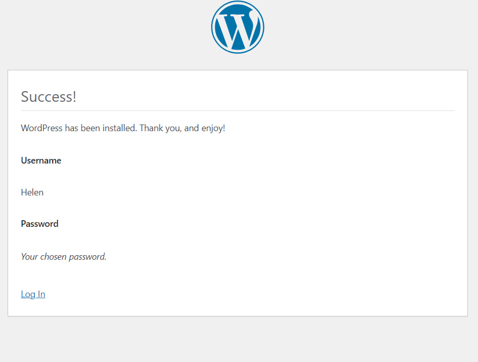

#  Лабораторная работа №4
# Задание
 __Создание образа контейнера для веб-сайта на базе Apache HTTP Server + PHP (mod_php) + MariaDB"__

## Цель работы
Цель данной работы состоит в подготовке образа контейнера для запуска веб-сайта на базе Apache HTTP Server + PHP (mod_php) + MariaDB.

## Выполнение

### Шаг 1: Извлечение конфигурационных файлов

1. Создан репозиторий containers04.
2. В репозитории создана папка `files` и подпапки `apache2`, `php`, `mariadb`.
3. Создан Dockerfile с необходимыми инструкциями для установки Apache, PHP, и MariaDB.

### Шаг 2: Постройка образа контейнера

1. Построен образ контейнера с именем `apache2-php-mariadb`.
2. Создан и запущен контейнер из этого образа с командой запуска bash.

### Шаг 3: Извлечение конфигурационных файлов

1. Извлечены файлы конфигурации Apache, PHP и MariaDB из контейнера в локальную папку `files`.

### Шаг 4: Настройка конфигурационных файлов

#### Конфигурационный файл Apache2
- В файле `files/apache2/000-default.conf` заменена строка `#ServerName www.example.com` на `ServerName localhost`.
- В строке `ServerAdmin webmaster@localhost` заменен почтовый адрес на мой.
- После строки `DocumentRoot /var/www/html` добавлена  строка
`DirectoryIndex index.php index.html`
- Файл сохранён .
- В конце файла `files/apache2/apache2.conf` добавлена строка `ServerName localhost`.

#### Конфигурационный файл PHP
- В файле `files/php/php.ini` раскомментирована и изменена строка `;error_log = php_errors.log` на `error_log = /var/log/php_errors.log`.
- Установлены параметры `memory_limit = 128M`, `upload_max_filesize = 128M`, `post_max_size = 128M` и `max_execution_time = 120`.

#### Конфигурационный файл MariaDB
- В файле `files/mariadb/50-server.cnf` раскомментирована строка `#log_error = /var/log/mysql/error.log`.

### Шаг 5: Создание скрипта запуска

- В папке `files` была создана папка `supervisor` и файл `supervisord.conf` с указанным содержимым.

### Шаг 6: Создание Dockerfile

- В файле `Dockerfile` были добавлены инструкции для монтирования томов, установки пакета `supervisor`, копирования и распаковки файлов  `WordPress`, копирования конфигурационных файлов для `Apache2`, `PHP` и `MariaDB`, а также скрипта запуска `supervisord`. Также была создана папка `/var/run/mysqld` и на неё были установлены права.

### Шаг 7: Создание базы данных и пользователя

- В контейнере `apache2-php-mariadb` были выполнены указанные SQL-команды для создания базы данных и пользователя `WordPress`.

### Шаг 8: Создание файла конфигурации WordPress

- Был скопирован файл конфигурации `WordPress` из браузера в файл `files/wp-config.php`.

### Шаг 9: Добавление файла конфигурации WordPress в Dockerfile:
-  Была добавлена инструкция в `Dockerfile` для копирования файла `wp-config.php` в папку `/var/www/html/wordpress/`.

### Шаг 10: Запуск и тестирование:

- Был пересобран образ контейнера с именем `apache2-php-mariadb` и запущен контейнер из этого образа. Далее была проверена работоспособность сайта `WordPress`.
### Успешно заработал WordPress!

### Ответы на вопросы:

1. Какие файлы конфигурации были изменены?
>Были изменены файлы конфигурации для `apache2, php, mariadb, supervisor` и добавлен файл конфигурации `WordPress` `(wp-config.php)`.

2. За что отвечает инструкция `DirectoryIndex` в файле конфигурации apache2?
>Инструкция `DirectoryIndex` в файле конфигурации `apache2` отвечает за определение приоритетного файла индекса, который сервер будет использовать при отображении директории без указания конкретного файла.

3. Зачем нужен файл `wp-config.php`?
>Файл `wp-config.php` нужен для конфигурирования подключения `WordPress` к базе данных, установки ключей безопасности, настройки кэширования и других параметров, необходимых для работы сайта.

4. За что отвечает параметр `post_max_size` в файле конфигурации `php`?
>Параметр `post_max_size` отвечает за максимально допустимый размер данных, отправляемых через `POST-запросы` на сервер.

5. Укажите, на ваш взгляд, какие недостатки есть в созданном образе контейнера?
>Есть неудобвство в повторном соединении с базой данных.То есть есть образ пересобирается надо повторно вводить команды  для его подключения к базе данных.

## Выводы:
Лабораторная работа была успешно выполнена. Образ контейнера с веб-сайтом на базе `Apache HTTP Server + PHP (mod_php) + MariaDB` был подготовлен, сайт `WordPress` был установлен и проверен на работоспособность. Конфигурационные файлы были настроены соответственно требованиям.

